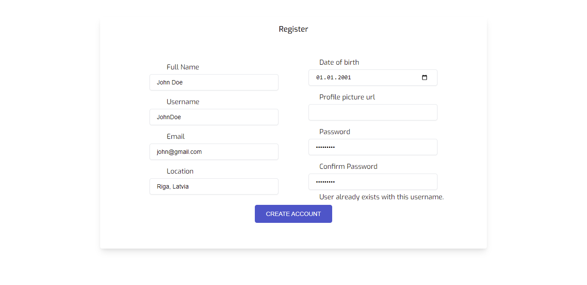
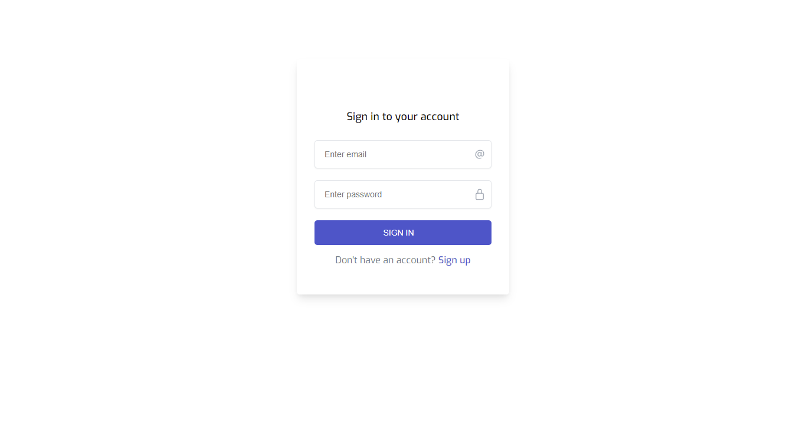

# chatApp

## ChatApp is a Java Spring Boot web application that allows users to register, login, and participate in group chat.


## Features:

- User Registration
- User Login
- Update User Profile
- Chat in Group Chat
- Error Handling: in case of errors during registration, login, and profile update, error messages are displayed


## Technologies Used:
- HTML - for web page structure
- CSS - for web page styling
- Java Spring Boot - for backend logic
- Thymeleaf - for connecting backend and frontend functionality
- MySQL - for database

## Project screenshots:

*Home page*
<div>
  
 </div>
 
 *Registration page*
<div>
  
</div>

 *Login page*
<div>
  
</div>

 *Chat page*
<div>
  
</div>

 *Profile/Profile update page*
<div>
  
</div>

 *Change Password page*
<div>
  
</div>


## Setup Instructions:

* Import the project into your preferred Java IDE.
* Update the database connection details in the application.properties, including the username and password for your MySQL server. 
  The spring.jpa.hibernate.ddl-auto property is set to "create" to automatically create the database tables when the application starts.
```
spring.datasource.username=YOUR_MYSQL_USERNAME
spring.datasource.password=YOUR_MYSQL_PASSWORD
spring.jpa.database-platform=org.hibernate.dialect.MySQL8Dialect
spring.jpa.hibernate.ddl-auto=create
spring.datasource.driver-class-name=com.mysql.cj.jdbc.Driver
spring.datasource.url=jdbc:mysql://localhost:3306/chatAppSpring?serverTimezone=UTC&createDatabaseIfNotExist=true
server.port=80

```
* After creating database, change spring.jpa.hibernate.ddl-auto property "create" to "update"

```
spring.jpa.hibernate.ddl-auto=update

```
* Build and run the project on a local server (e.g., Tomcat).
* Access the web application in your web browser using the URL provided by your local server (http://localhost:80).
* Create a new account for User to explore and use the Chat Application.

  http://localhost:80
  
  http://localhost/register

  http://localhost/login


Note: This is a Java learning project, the main focus is on backend development rather than frontend.
Therefore, the webpage may not be fully responsive as it is not the primary focus of the project. 

